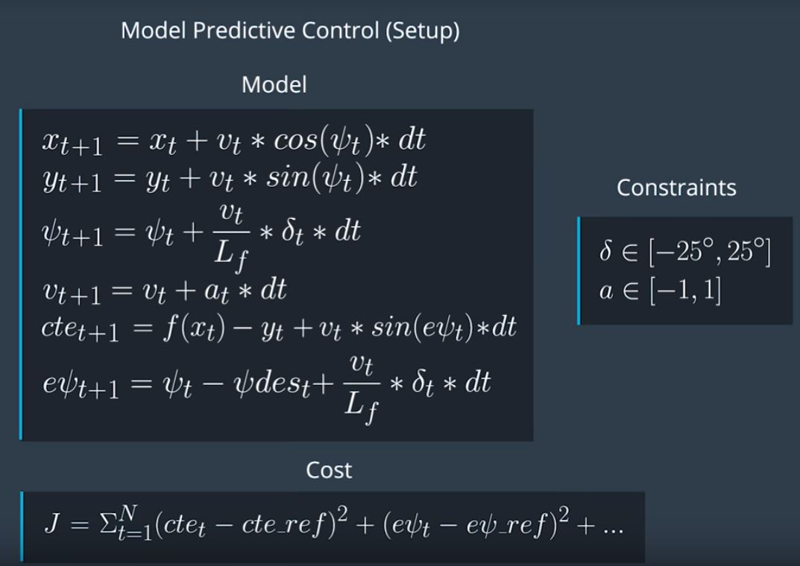
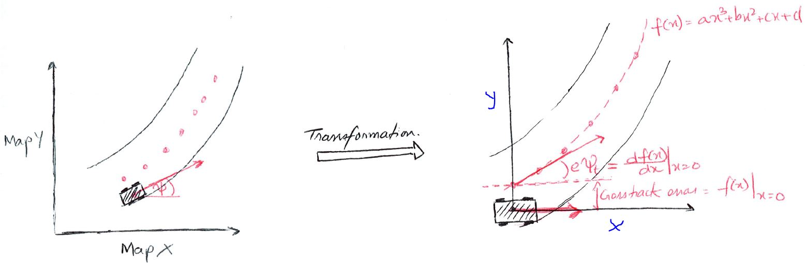

# CarND-Controls-MPC
Self-Driving Car Engineer Nanodegree Program

---

## Project Introduction

#### Submission
This repository contains all the code needed to complete the Model Predictivve Control for Car project

## Running the Code
This project involves the Term 2 Simulator which can be downloaded [here](https://github.com/udacity/self-driving-car-sim/releases). 
My setup is done using windows with docker installed. The remaining setup was done as a linux system.The main protcol is that main.cpp uses for uWebSocketIO in communicating with the simulator.
1. Clone this repo.
2. Make a build directory: `mkdir build && cd build`
3. Compile: `cmake .. && make`
4. Run it: `./mpc`.

Tips for setting up the environment can be found [here](https://classroom.udacity.com/nanodegrees/nd013/parts/40f38239-66b6-46ec-ae68-03afd8a601c8/modules/0949fca6-b379-42af-a919-ee50aa304e6a/lessons/f758c44c-5e40-4e01-93b5-1a82aa4e044f/concepts/23d376c7-0195-4276-bdf0-e02f1f3c665d)

## Implementation

### Description of Model and Cost Function
The model for predictive car control is same as discussed in the class. The model update equations are same as shown in the following image.

In the simulator, since delta rotation is opposite to the convention followed in the model equations, in the model eqution mentioned above, delta is replaced with negative delta. The cost function was implemented as sum of 
squared values of following parameters

1. Cross track error
2. Orientation error
3. Difference between current and target velocity
4. Values of actuators; steering and acceleration.
5. Gap between sequential actuations; change in steering and acceleration.

Since the order of all the above values is not the same and also each value needs to be assigned importance, a weight for each of the above parameter. Weight is tuned manually by visualizing the motion of the car whenever each weight
is changed.

### Decision on Timestep Length and Elapsed Duration
The elapsed duration determines the portion of track to be considered for solving the constraints of the model. If kept very small it will be unable to follow the track well and will result in very sharp turns and acceleration changes. 
If it is kept too long it will try to fit for more than required and sometimes when the track is very curvy it may not be able to solve and that can result in wrong acutations. Hence there is an ideal duration that works best.
Also the lenght of track the car will cover in an elapsed duration depends on the speed of the car, this ideal elapsed duration increases as the speed of car increases. Hence first I kept my target speed as what I wanted and then tuned
the elapsed time. The decision on timestamp length also affected the solution for constraints. He the lenght is kept too long, it will result in car running longer for the given actuation which is not desired on long turns. If it is kept too 
small than it results in redundant or very similar solutions for each timestamp and hence is an overkill on computation.   

### Transformation and Polynomial Fitting
Since the cooridinates for the pathway are given in the coordinate system of the map, they first need to be transformed to the coordinate system of the car. The coordinate system for car is defined as center at the current position of the 
car and oriented such that the angle between car and X axis is 0. After this transformation, a 3rd order polynomial `f(x)` is fit to the way points. For given x,y position of the car, the crosstrack error can be obtained as `y-f(x)` and the
error in angle as `f'(x)`. For more details please refer to the following figure.

### Latency Implementation

Latency in actuation can be modeled by keeping the current actuation same for the duration of latency and predicted the position and orientation of car and the errors when the actuation will actually happen. This can be computed
by applying the model update equations using the current value of the parameters and delta t as value of latency. The initial cross track error can be obtained by evaluating `y-f(x)` at `x = 0` and angle error as `f'(x)` also at `x = 0`.
These model paramters prediced after latency are fed to the mpc model to get the values of actuation which are to be applied now which will have effect after the duration of latency.

## Code Modifications

Following modifications are done in the code to implemented all the above discussed functionalities.

1. `Main.cpp`
	1. Added variables to read steering angle and acceleration from json objects.
	2. Implementated transformation of way points in the car coordinate system.
	3. Called polyfit function to fit a 3rd order polynomial to the way points and get the coefficients.
	4. Implemented model update equations to use latency and current state of car to prediced state after the delay of latency.
	5. Called `mpc.Solve` function by giving predicted state after delay and coefficients as input and obtained acutation values and predicted positions of car after solving constraints.
	6. Normlaized these acutation values and passed them to the json message to be used in simulater.
	7. Passed the predicted positions of car to be displayed as green markers.
	8. Evaluted 3rd order polynomial at different incremental x positions and passed these x,y positions to be displayed as yellow markers.
	
2. `MPC.cpp`
	1. Set the timestep length and duration
	2. Set the reference velocity
	3. Set weights and array indeces for different model parameters.
	4. In `FG_eval` implemented `operator()` function by defining cost, starting values and model constraints.
	5. In `MPC::Solve()` using the input state, initialized the variables and set upper and lower bounds for variables and constraints.  
	6. Also in `MPC::Solve()` stored the results for actuation and predicted x,y positions and returned the results.

3. `MPC.h`
	1. Set the timestep length and car turning radius. These are same as defined in `MPC.cpp`
	
## Simulation
I found that the results are sensitive to the mode of simulater. I have chosen screen as 640 x 480 and graphics as fastest. The final commited model and chosen weights enabled the car to remain on track very effectively even at speed of 50 mph. 
Also I noticed that during recording, the PC was getting stuck and hence it was affecting the navigation of the car and hence performance was little poorer when recording was happeneing in background. 
Following video shows how the car navigated with the final chosen parameters. 

It can be observed that the car was able to remain on track thoughout the run.

## Scope of Improvement
I believe the weights that are given can further be tuned. Also right now the ref velocity is same for straight segments and for turns. Ideally it should be higher for straight segements and lower for turns because this is how we drive naturally.
Hence a method to adapt reference velocity depending on the curvature of the pathway can be introduced.